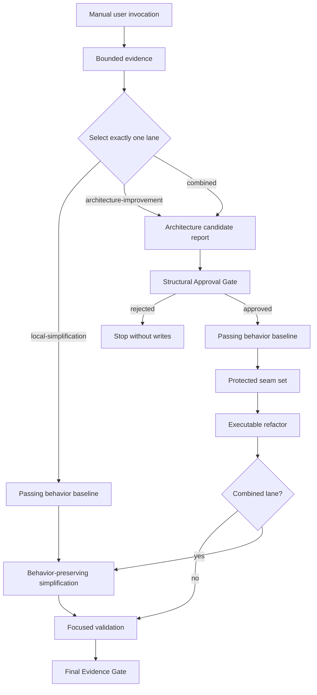

# Codebase Improvement Workflow

## State machine

## Lane selection signals

### `local-simplification`

Signals: readability, naming, nesting, duplication, dead code, or unnecessary
implementation abstraction inside an already valid boundary. The module
structure, interfaces, and side-effect shape are not in question.

Anti-signals: the change requires new modules, new interfaces, cross-module
coupling changes, or testability improvements that depend on interface
redesign.

### `architecture-improvement`

Signals: shallow modules, leaking seams, poor locality, cross-module coupling,
or testability constrained by current interfaces. The improvement requires
changing approved module boundaries or interface contracts.

Anti-signals: the problem is confined to implementation clarity within an
already valid module boundary and does not require structural change.

### `combined`

Signals: an approved architecture refactor whose changed implementation also
contains bounded simplification opportunities. Both structural and local
clarity improvements are evidenced.

Anti-signals: either the structural or the simplification case is not
supported by bounded evidence.

## No silent lane escalation

If the initial evidence selects `local-simplification` but the work reveals
an architecture problem, stop and ask the user before changing lanes. Do not
proceed into architecture writes on a `local-simplification` selection.

## Structural Approval Gate

For `architecture-improvement` and `combined` lanes, present the candidate
report, expected file set, and affected interfaces before any write. Stop and
wait for explicit user approval. Domain-model and ADR writes require the same
approval boundary.

## Passing behavior baseline

Before any executable refactor, establish that the current code passes its
focused validation. Record the command and result. This baseline is the
reference point for the post-refactor check.

## Protected seam set

Before any executable refactor, record the approved modules, interfaces,
adapters, side effects, error behavior, ordering, and test surfaces that the
refactor must not alter. Simplification applies only within these bounds.

## Behavior-preserving simplification

Apply `/addyosmani-code-simplification` only for `local-simplification` or the
approved changed scope of `combined`. The simplification must not alter any
entry in the Protected seam set.

## Executable refactor

For executable changes, load `/internal-tdd` before implementation. Apply the
refactor within the approved scope and protected seam set.

## Focused validation

Run the focused test or check identified during lane selection. The check
must cover the changed files and their direct dependents.

## Final Evidence Gate

Load `/superpowers-verification-before-completion` and present fresh passing
evidence before claiming completion.

## Stop conditions

- Missing Passing behavior baseline.
- Unclear ownership or affected-file set.
- Focused validation fails after refactor.
- Simplification would change a protected architecture seam.
- Evidence does not support the selected lane.
