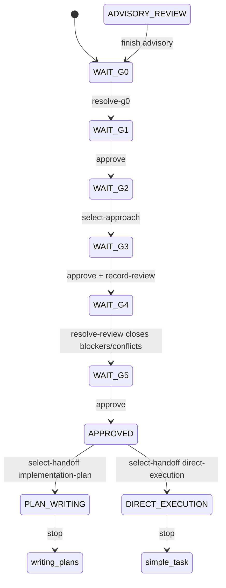

# Internal Gateway Idea

## Local owners

- `references/design-template.md` owns the Markdown design shape and the
  separate `state.json` example.
- `scripts/idea_state.py` owns `internal-gateway-idea-state/v2`, typed events,
  transitions, approvals, hashing, persistence, review binding, and CLI
  projections.
- `internal-gateway-critical-master` produces a generic readable critical
  report. `scripts/critical_report_adapter.py` owns the consumer-side
  conversion that binds that report to the current source, design path, and
  revision before review ingestion.
- `scripts/idea_state.py::record_readable_review` is the single consumer entry
  point for adapting a readable report and recording it at G3. The packet API
  remains only as an internal compatibility boundary.
- `scripts/idea_state.py` validates the adapted
  `internal-gateway-critical/full-analysis-v1` boundary, consolidates findings,
  and stores only decision-relevant ledger rows. The critical skill does not
  know this boundary.
- After G5 approval, this gateway remains the owner until the user selects a
  handoff. `implementation-plan` routes to `/internal-gateway-writing-plans`;
  `direct-execution` routes to `/internal-gateway-simple-task`.
- G5 design approval alone never creates a plan or authorizes implementation.
  The explicit handoff choice authorizes only its selected next gateway; that
  gateway retains its own scope, authority, and validation boundaries.

## When to use

Use this gateway when a repository-owned request begins as an idea, option set,
proposed direction, or unclear goal and must be shaped and critically resolved
before a plan is written or a bounded direct-execution handoff is selected.

## Runtime boundary

The canonical state is `internal-gateway-idea-state/v2`. Runtime persistence
has exactly two stable artifacts under `tmp/idea/<slug>/`: `design.md` and
`state.json`. Before normal G0, neither artifact exists. `init --event
resolve-g0` accepts the required typed G0 decisions, writes bounded `design.md`
first, and creates `state.json` at `WAIT_G1`, revision 1. After G5 approval,
`APPROVED` is a deliberate pause: it means the design is approved but the
post-design handoff has not been selected. `PLAN_WRITING` and
`DIRECT_EXECUTION` are terminal handoff states.

The design has no YAML front matter and never duplicates JSON state. Before G3
it contains only intent, accepted decisions, open decisions, selected approach,
and essential evidence, with a maximum of 300 non-whitespace tokens. After
critic ingestion, the same design may contain the consolidated review ledger.
There are no packet files, review files, transcripts, status siblings, or
`state.yaml` aliases.

Each artifact replacement is individual and ordered: flush and atomically
replace `design.md`, compute its exact UTF-8 SHA-256, then flush and atomically
replace `state.json`. This is not a cross-file transaction. A crash between
replacements yields a hash mismatch and must reopen the earliest safe gate;
the gateway never guesses progress or banks stale approval.

## Mandatory G0-G5 contract

Every user message may advance only the current gate. Content-bearing answers
are typed events. The state helper validates event shape and current-gate
legality but never semantically infers a typed decision from free-form prose.

| Gate | Persisted state | Required event | Result |
| --- | --- | --- | --- |
| G0 | `WAIT_G0` | `resolve-g0` with typed intent, decisions, constraints, success criteria, and anti-scope | `WAIT_G1` |
| G1 | `WAIT_G1` | simple approval | `WAIT_G2` |
| G2 | `WAIT_G2` | `select-approach` with typed approach data | `WAIT_G3` |
| G3 | `WAIT_G3` | current-turn simple approval, then `record-readable-review` | valid report persists `WAIT_G4` |
| G4 | `WAIT_G4` | `resolve-review` with typed disposition, remedy, and risk decision | `WAIT_G5` only when blockers and conflicts close |
| G5 | `WAIT_G5` | simple approval | `APPROVED`, then stop before any handoff |

The post-G5 handoff is a separate typed decision and is never inferred from a
short approval or from free-form execution language:

| Handoff state | Required event | Result |
| --- | --- | --- |
| `APPROVED` | `select-handoff` with `mode: implementation-plan` | `PLAN_WRITING`, then stop at `/internal-gateway-writing-plans` |
| `APPROVED` | `select-handoff` with `mode: direct-execution` | `DIRECT_EXECUTION`, then stop at `/internal-gateway-simple-task` |

G3 approval is not banked by itself. When the critic is available in that same
assistant turn, the gateway must call `record_readable_review`, which adapts the
readable report, validates the bound current-revision packet, and persists it
before the turn ends at `WAIT_G4`. If adaptation, validation, or persistence is
interrupted, `WAIT_G3` remains authoritative and the critic is rerun after
resumption.

## Short approvals and presented defaults

Normalize by trimming surrounding whitespace, case-folding, and removing only
terminal `.`, `!`, or `?` punctuation. The remaining whole message must be one
legal token: `ok`, `approvo`, `continua`, `va bene`, or `procedi`.

`OK!`, `continua.`, and `procedi?` are legal. `okay`, `not ok`, `ok,` or
`ok, implementa`, `please continua`, `procedi domani`, compounds, substrings,
imperative requests, future approvals, and execution phrases are not legal.

At G0, G2, and G4, a legal short approval accepts only the currently presented
recommended/default decision. The compliant gateway supplies the corresponding
typed payload through `PresentedDecision`; the helper does not inspect or infer
the user's prose. A captured free-form answer must be converted by the gateway
to the same typed payload before submission. At G1, G3, and G5, a legal short
approval maps to the simple approval event for that gate.

After G5 approval, do not treat `ok`, `procedi`, or an execution phrase as the
handoff choice. Ask one focused question and submit exactly one typed
`select-handoff` payload: `{"mode":"direct-execution"}` for
`/internal-gateway-simple-task`, or `{"mode":"implementation-plan"}` for
`/internal-gateway-writing-plans`. Reject ambiguous or compound answers and
keep `APPROVED` authoritative until one valid mode is recorded.

## Critic and advisory boundaries

The readable critical report is an internal input to the consumer adapter, not
a user shortcut. `record_readable_review` calls
`critical_report_adapter.py`, which requires numbered evidence with critique,
evidence, suggestion, why, and explicit blocking fields; it supplies the
current source, design path, and revision and produces the bound in-memory
`full-analysis-v1` packet. The existing packet validator then checks the exact
keys, findings, evidence, diagnostics, and outcome invariants. Invalid-target
packets and no-context reports cannot be ingested. A standard review is
required; high assurance also requires an independent review. Sources cannot be
duplicated or invented. Valid findings are consolidated deterministically into
the design ledger, merging equivalent evidence and keeping recommendation
conflicts open. Neither the raw report nor packet JSON is persisted.

For the state CLI, use `advance --event record-readable-review` with a payload
containing the readable `report` and optional `source`; the consumer derives the
current design path and revision from the loaded state.

`resolve-review` is a separate user disposition/remedy/risk event. It can reach
G5 only after all open blockers and conflicts close. An unresolved disposition
returns to the earliest affected gate and revision. Advisory report adaptation
and packet ingestion are optional, remain non-mandatory, and cannot populate
`review_sources`, `reviewed_revision`, or `approved_revision`.

An on-demand advisory may create the bounded two-artifact pair before G0 at
`ADVISORY_REVIEW`, with `advisory_return_state: WAIT_G0`. Finishing it returns
to exactly `WAIT_G0`; it never satisfies mandatory G4 review.

## Fail-closed recovery and handoff

Missing, malformed, stale, v1, or hash-mismatched adapted evidence clears later
review and approval claims and returns to the earliest gate that can be proven.
An orphaned bounded design is uninitialized and may be retried through `init`.
Unexpected stable artifacts, future events, invalid short approvals, stale
reports or packets, unavailable mandatory critic evidence, and scope drift stop
progress.

G5 approval stops in `APPROVED` before any plan is created or
`/internal-gateway-writing-plans` is invoked. The next user-facing question is:
"Preferisci l'esecuzione diretta tramite `/internal-gateway-simple-task` oppure
la creazione del piano tramite `/internal-gateway-writing-plans`?" A valid
`select-handoff` choice is required before routing. `implementation-plan` then
routes to `/internal-gateway-writing-plans` without authorizing execution;
`direct-execution` routes to `/internal-gateway-simple-task`, whose gateway
must revalidate that the outcome is concrete, bounded, and locally verifiable.
The direct route authorizes that selected local execution handoff only; live
provider operations still require the downstream gateway's explicit authority.

## CLI projection and validation

The state helper supports `init`, `advance`, `inspect`, `recover`, and optional
advisory start operations. `advance --event select-handoff` requires a typed
`mode` payload and persists `PLAN_WRITING` or `DIRECT_EXECUTION` only after
`APPROVED`. `inspect --compact` and `recover --compact` emit one line
containing the state, revision, next actor, legal event names, and one next
action. Diagnostics go to stderr; event payloads never enter either artifact.

Validate the executable seams with the focused pytest suite, strict internal
skill validation, token-risk detection, directly owning shared tests, the
static skill benchmark, changed-path scope validation, and `git diff --check`.
Use human review for semantic proportionality and exact gate wording; do not
turn subjective prose into a snapshot test. External tamper resistance is out
of scope.
