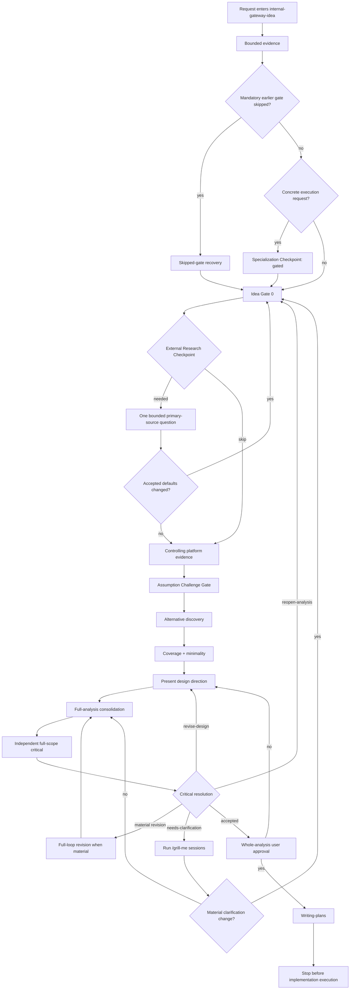

# Internal Gateway Idea Workflow

This workflow is the canonical contract for `internal-gateway-idea`. The
delegated core workflow is `/superpowers-brainstorming`; this wrapper owns the
repository-specific evidence, state, critique, approval, and routing gates.

## State Machine



The visible order is: bounded evidence -> Idea Gate 0 -> controlling platform
evidence -> assumption challenge -> alternatives -> coverage + minimality ->
design presentation -> full-analysis consolidation -> independent full-scope
critical -> full-loop revision when material -> whole-analysis user approval ->
writing-plans -> stop before implementation. External research is a conditional
checkpoint after Idea Gate 0 and before platform evidence.

## State Boundary and Single Spec

Multi-turn continuity uses exactly these two best-effort artifacts:

```text
tmp/idea/<slug>/state.yaml
tmp/idea/<slug>/design.md
```

`state.yaml` is limited to this illustrative schema:

```yaml
status: shaping
active_gate: idea-gate-0
design_version: 1
updated_at: 2026-08-08T00:00:00Z
next_action: Resolve the numbered questions.
approved_decisions: []
open_decisions: []
design_path: tmp/idea/<slug>/design.md
plan_path: null
```

The timestamp and values are illustrative, not fixed runtime values. Update
state only after accepted decisions, design revisions, critical outcomes, final
approval, or an explicit pause. Do not append a transcript. State is not
durable storage, a security boundary, or machine authorization for planning.
When the directory is missing, stale, or corrupt, reconstruct a draft from
available evidence and invalidate claimed approval and critique. Never
overwrite an existing slug with different intent.

`design.md` is the single living spec and coverage artifact. It must contain
original intent versus emerged requirements, evidence, assumptions, two or
three approaches, recommendation and tradeoff, coverage map, design,
validation, anti-scope, material risks, and open decisions. Do not write a
duplicate under `tmp/superpowers/specs/`.

## Evidence Contracts

Before design presentation and again before whole-analysis approval, map every
explicit deliverable with this row:

```text
requirement ID | user deliverable | nearest owner/design element | consumer | validation | status or approved anti-scope
```

When three or more owners or runtime surfaces are involved, add `interface` and
`independent-decision` columns. A missing deliverable or unexplained anti-scope
blocks advancement.

If platform semantics control feasibility or ownership, verify controlling
primary-source evidence before architecture defaults. Adapter-only evidence is
not authoritative and routes to analysis or the external research checkpoint.

Before selecting a new abstraction, compare `no-new-artifact`, `existing-owner`,
and `new-abstraction`. A selected new abstraction must state its invariant,
footprint and maintenance rationale, and exit criterion. The smallest option
that satisfies the requirements remains preferred.

Before the critical pass, recompose the complete current `design.md`. The
critical packet identifies that file as the complete target and provides raw
evidence rather than the parent's intended conclusion. Require at least one
independent full-scope critic. A same-context self-review or delta-only critique
may identify a finding but cannot authorize planning. If independent dispatch
is unavailable, fail closed with `request-separate-review` and do not write a
plan.

A material change to requirements, scope, ownership, platform assumptions,
selected alternative, coverage, validation, anti-scope, or material risk
invalidates the previous full-scope result. Recompose the full design and run a
new independent full pass before approval.

## Gate Contract

| State | Required behavior | Forbidden behavior |
| --- | --- | --- |
| `Specialization Checkpoint: gated` | Record when an incoming request is execution-shaped and name the later execution owner only as a future consequence. | Do not execute or present a post-critical recommendation from this checkpoint. |
| `Bounded evidence delegation checkpoint` | The parent may invoke `internal-luna-executor` with the evidence question, relevant sources, expected output, and validation. | Do not delegate intent, synthesis, alternatives, critical resolution, research ownership, or approval. |
| `Skipped-gate recovery` | Stop the current lane, mark downstream artifacts draft-only, and resume at the first skipped gate. | Do not continue from an invalid later state. |
| `Idea Gate 0` | Render one numbered bulk block with `Question`, `Recommendation`, `Why`, and `Default if accepted`; capture intent, defaults, constraints, success criteria, validation, and anti-scope. | Do not treat evidence as approval or proceed before acceptance. |
| `External Research Checkpoint` | Run only when one external primary-source fact could change feasibility, approach, constraints, or risk; use one bounded report under `tmp/.research/`. | Do not preload research or run a second pass automatically. |
| `Controlling platform evidence` | Verify platform semantics before architecture defaults whenever they control feasibility or ownership. | Do not treat a local adapter as authoritative platform semantics. |
| `Assumption Challenge Gate` | Test whether the proposed target or solution is necessary and identify a smaller reversible alternative. | Do not only polish the proposed solution. |
| `Alternative discovery` | Present 2-3 approaches with `Best when` and `Tradeoff`, and explain the recommendation. | Do not present one path as inevitable. |
| `Coverage + minimality` | Complete the coverage map and compare the three minimality baselines before presenting the design. | Do not omit a deliverable, unexplained anti-scope, or selected-abstraction invariant/exit criterion. |
| `Present design direction` | Present the complete `design.md` contents and obtain design-direction approval before critical review. | Do not approve or plan from a partial section. |
| `Full-analysis consolidation` | Recompose the complete current analysis and coverage map before critique. | Do not send a delta-only packet as the full target. |
| `Independent full-scope critical` | Use a distinct context-bounded critic over the complete analysis. If unavailable, route `request-separate-review`; only `accepted`, `revise-design`, `reopen-analysis`, or `needs-clarification` are outcomes. | Same-context self-review or delta-only criticism cannot authorize planning. |
| `Full-loop revision when material` | Recompose and rerun the full independent critique after a material change. | Do not reuse a stale critique. |
| `Whole-analysis user approval` | After objections are closed, routed, or named as residual risks, ask one explicit current-conversation question authorizing plan writing. | Do not infer approval from gate-local approvals, stale state, or critic `accepted`. |
| `Writing-plans` | Load `/internal-gateway-writing-plans` only after whole-analysis approval and stop after its writing outcome. | Do not implement, invoke execution owners, or modify downstream gateways. |

## Approval and Routing Rules

- `procedi`, `ok`, `go`, or similar approval advances only the active visible
  gate. Clarify ambiguous approval before loading another owner.
- Approval of a design direction is not approval to write a plan. Critic
  `accepted` is not approval to write a plan.
- Only one current-conversation approval of the entire current analysis may
  authorize `/internal-gateway-writing-plans`. If residual risk remains, name
  the risk being accepted in the question.
- If a mandatory gate was skipped, use skipped-gate recovery; approval words
  cannot heal it. If state is stale or missing, reconstruct a draft and discard
  claimed approval and critique.
- Keep implementation execution out of this workflow. Stop after the writing
  outcome.

## User-facing and Runtime Stability

State-machine labels remain internal. Normal chat emits one compact decision
card for status, approval, routing, material risk, blocker, and requested user
action. Use the owning schema for guided questions, alternatives, design
sections, and critique packets. Do not print internal ledgers or skipped
checkpoints.

The transition notification after the one whole-analysis approval is exactly:

```text
🚀 **Scrittura del piano avviata**
✅ La critica si è conclusa senza obiezioni materiali aperte.
🛠️ `/internal-gateway-writing-plans` sta preparando il piano di implementazione.
```

If a fresh subagent or isolated agent dispatch is unavailable for independent
critique, fail closed with `request-separate-review`; do not substitute a
same-context review. The checkpoint uses one bounded research question and
does not start a second research pass automatically.
