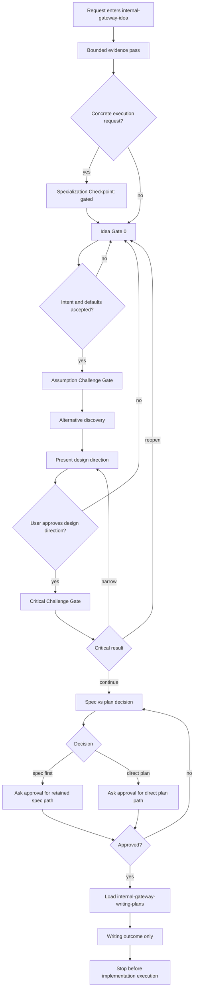

# Internal Gateway Idea Workflow

This workflow applies only to `internal-gateway-idea` while it coexists with
`internal-gateway-idea-brainstorming`. It strengthens the future replacement
bundle without changing the current canonical gateway catalog.

## State Machine

## Gate Contract

| State | Required behavior | Forbidden behavior |
| --- | --- | --- |
| `Specialization Checkpoint: gated` | Use when the incoming ask is already a file edit, command run, validator run, implementation step, or other execution-shaped request. Name the later execution owner only as a future consequence. | Do not execute, hand off, or present the post-critical recommendation. |
| `Idea Gate 0` | Confirm the recovered intent, defaults, constraints, success criteria, and validation path. Use the core `superpowers-brainstorming` questioning style. | Do not treat repository evidence alone as user approval. |
| `Assumption Challenge Gate` | Test whether the proposed target or solution is necessary before choosing an approach. | Do not only polish the user's proposed solution. |
| `Alternative discovery` | Present 2-3 approaches and explain why the recommended one beats the strongest rejected option. | Do not present a single-path design as inevitable. |
| `Critical Challenge Gate` | Challenge the chosen direction before spec or plan writing. Reopen or narrow when the objection is material. | Do not use this gate after loading `internal-gateway-writing-plans`. |
| `Spec vs plan decision` | Choose `Decision: direct plan` or `Decision: spec first`, explain why, name the rejected path, and ask for approval. | Do not load `internal-gateway-writing-plans` from the decision alone. |
| `Writing outcome only` | Load `internal-gateway-writing-plans` only after explicit user approval for the selected writing path. Stop after the delegated writing outcome. | Do not implement, edit target files, run execution commands, or invoke execution owners. |

## Approval Rules

- `procedi`, `ok`, `go`, or similar approval advances only the active visible gate.
- If the active gate is ambiguous, ask whether the user means critical review,
  retained spec or plan writing, or implementation execution.
- Approval of a design direction is not approval to implement.
- Approval of `Decision: direct plan` skips a retained spec, not the user
  approval gate and not the stop-before-execution boundary.

## Coexistence Rule

This bundle is the future replacement direction, but this workflow does not
retire, rename, or rewrite `internal-gateway-idea-brainstorming`. Global
canonical routing stays unchanged until a separate cleanup request updates the
old bundle, wrapper agents, inventory, sync surfaces, and repository contracts
together.
