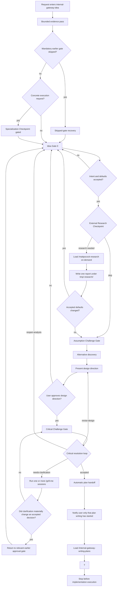

# Internal Gateway Idea Workflow

This workflow defines the canonical contract for `internal-gateway-idea`.
The delegated core workflow is `/superpowers-brainstorming`; this wrapper
defines the local routing contract after critical resolution.

## State Machine



## Gate Contract

| State | Required behavior | Forbidden behavior |
| --- | --- | --- |
| `Specialization Checkpoint: gated` | Use when the incoming ask is already a file edit, command run, validator run, implementation step, or other execution-shaped request. Name the later execution owner only as a future consequence. | Do not execute, hand off, or present the post-critical recommendation. |
| `Bounded evidence delegation checkpoint` | After the evidence question, inputs, output, write scope, validation, and stop conditions are locked, route only token-intensive evidence collection through `/internal-low-cost-delegation`. | Do not delegate intent, synthesis, alternatives, critical resolution, external-research ownership, or approval. |
| `Skipped-gate recovery` | Stop the current lane, name the first skipped mandatory gate, mark downstream artifacts draft-only, and resume at that gate. | Do not continue from an invalid later state or ask the user to approve a handoff built on skipped gates. |
| `Idea Gate 0` | Confirm the recovered intent, defaults, constraints, success criteria, validation path, and anti-scope internally; render all currently known unresolved questions in one numbered bulk question block with `Question`, `Recommendation`, `Why`, and `Default if accepted`; evidence cannot replace Idea Gate 0. | Do not treat repository evidence alone as user approval, and do not proceed to challenge, alternatives, design, or planning until this gate is accepted. |
| `External Research Checkpoint` | Skip unless local evidence is insufficient and one external fact could change feasibility, approach, constraints, or risk. When needed, load `/mattpocock-research` on-demand with one bounded question, write one Markdown report under `tmp/.research/`, and return only decision-relevant conclusions. | Do not preload the research skill, copy its research procedure, run generic best-practice research, or start a second research pass automatically. |
| `Assumption Challenge Gate` | Test whether the proposed target or solution is necessary before choosing an approach. | Do not only polish the user's proposed solution. |
| `Alternative discovery` | Present 2-3 approaches and explain why the recommended one beats the strongest rejected option. | Do not present a single-path design as inevitable. |
| `Critical Challenge Gate` | Challenge the chosen direction as its own visible gate after design-direction approval and before plan writing. Return `accepted`, `revise-design`, `reopen-analysis`, or `needs-clarification`; `accepted` is legal only when every material objection raised during the current critical pass is closed or explicitly routed. | Do not use this gate after loading `/internal-gateway-writing-plans`; an embedded critique does not satisfy Critical Challenge Gate. |
| `Critical resolution loop` | For `revise-design`, return to design presentation and approval; for `reopen-analysis`, return to `Idea Gate 0`; for `needs-clarification`, load `/grill-me` for one or more numbered clarification sessions over the critic's newly surfaced elements. A material change returns to the relevant earlier approval gate; unchanged clarifications rerun `Critical Challenge Gate` directly. | Do not force a clarification into planning or silently discard a new material point. |
| `Automatic plan handoff` | For `accepted`, start implementation-plan writing immediately and emit only the approved three-line transition card. | Do not ask whether to write a spec, request another plan-writing approval, or write a retained spec. |
| `Writing outcome only` | Load `/internal-gateway-writing-plans` automatically after `accepted`. Stop after the delegated writing outcome. | Do not implement, edit target files, run execution commands, or invoke execution owners. |

## Approval Rules

- `procedi`, `ok`, `go`, or similar approval advances only the active visible gate.
- If the active gate is ambiguous, ask whether the user means design approval,
  critical review, or implementation execution.
- If a previous mandatory gate was skipped, approval words cannot heal it. Use
  `Skipped-gate recovery` and resume at the first skipped mandatory gate.
- Approval of a design direction is not approval to implement.
- `accepted` authorizes automatic plan writing, not implementation execution.

## Routing Stability Rule

The state-machine labels are internal workflow state. Normal chat emits one compact user-facing decision card for status, approval, routing, material risk, blocker, and requested user action, and never dumps the state-machine trace.
Content-bearing output uses its owning schema and is outside the four-line card limit. Guided questions, alternatives, design sections, and required critique schemas are content-bearing output.
Use 🎯 for a goal, 🧭 for a decision, 🛠️ for a proposed change, 🧪 for validation, ⚠️ for a material risk or blocker, ✅ for a recommendation or result, 💡 for a short reason, and ✈️ for a requested user action.
Skipped checkpoints remain silent. Material risks, blockers, validation gaps,
and user decisions remain visible.

The transition notification is exactly:

```text
🚀 **Scrittura del piano avviata**
✅ La critica si è conclusa senza obiezioni materiali aperte.
🛠️ `/internal-gateway-writing-plans` sta preparando il piano di implementazione.
```

This is the only transition notification. The subsequently produced
implementation plan remains normal content-bearing output.

The checkpoint must use one bounded research question; do not start a second research pass automatically.
