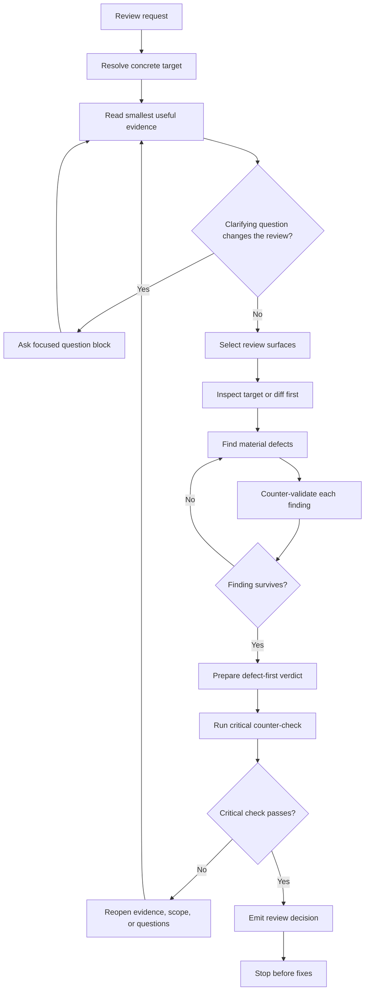

# Internal Gateway Review

## Referenced skills

- `internal-gateway-critical-master`: final autonomous counter-check when findings, no-finding verdicts, or next-action choices need pressure before action.

Portable review gateway. Owns review scope, evidence discipline, findings
consolidation, decision-usefulness, and final counter-check. It does not apply
fixes, author retained plans, or preload specialist review skills.

Use the target itself to choose review depth. Keep review thinking local unless
the user directly selected a specialist owner or a separate prompt already
selected one.

Before any user-visible verdict, counter-check the analysis for evidence,
severity, false positives, contrary evidence, scope narrowing, and decision
usefulness. Use `internal-gateway-critical-master` at the end when the review
depends on a material judgment, a no-finding claim, or a proposed next action.
Revise or reopen when the counter-check exposes a material gap.

## Workflow

## Review Surface Selection

Select review surfaces from the changed paths, stated goal, and evidence gaps;
do not start from a single default lens. A diff may activate more than one
surface. This gateway names surfaces, not specialist skill dependencies.

- Code surface: changed source, scripts, tests, build files, dependency files,
  generated-code boundaries, and validation paths.
- System surface: architecture, workflow, ownership, rollout, cross-boundary
  impact, operational fit, and merge risk.
- AI-resource surface: repository-owned prompts, agents, skills, instructions,
  bundle siblings, catalog files, sync behavior, and customization drift.

When the diff is mainly AI customization assets, review the AI-resource surface
first and treat embedded scripts as a secondary code surface. Do not let a
language-oriented scan silently skip `.md` skill, agent, prompt, instruction, or
inventory files.

## Review Procedure

1. Resolve the concrete target: artifact, diff, PR, workflow, bundle, retained
   report, or explicit file list.
2. Identify intent, anti-scope, changed surfaces, validation already run, and
   evidence gaps from the smallest useful local evidence.
3. Ask a focused question before analysis only when the answer would change
   scope, severity, owner, or the review decision.
4. Inspect the diff or target first, then read immediate owning context only
   when a finding or uncertainty needs it.
5. Check design fit, functionality, security, complexity, tests, naming,
   comments, documentation, consistency, and changed-user impact when relevant.
6. For each potential finding, test the contrary explanation before reporting
   it: intended behavior, local convention, compatibility, generated output,
   explicit user scope, or validator coverage.
7. Report at most 5 material findings unless exhaustive review is requested.
8. For low-finding or no-finding reviews, include evidence coverage, residual
   risk, and the next decision the reader can make.
9. Run the final `internal-gateway-critical-master` counter-check before the
   verdict and reopen the analysis if it changes severity, confidence, scope,
   or next action.

## Token Discipline

Inspect diff and failing evidence first; avoid broad repository scans unless an
evidence gap requires one. Prefer aggregate facts for large diffs, generated
files, tabular exports, and logs before reading raw volume. Summarize omitted
low-risk observations separately, not as findings.

Use `Compact Evidence Reporting` for large diffs, generated files, tabular
exports, and logs: keep findings defect-first, cite the smallest excerpt or
file point that proves impact, and avoid dumping large raw blocks when a
targeted excerpt plus evidence path preserves the same proof.

## Output Contract

Findings must lead, ordered by severity. Each material finding carries:

- finding and impact;
- severity and confidence;
- smallest evidence point;
- evidence gap, if any;
- counter-validation result;
- next owner or route;
- validation expected.

End with one Review Gate outcome:

- `review gate: satisfied` when findings or no-finding claims are specific,
  counter-validated, decision-useful, and ready for the user-visible verdict.
- `review gate: reopen` when material evidence is missing, contrary evidence
  weakens a finding, severity is uncertain, scope is too broad, or the visible
  verdict would not support a clear next decision.

The final verdict must support one clear next decision: accept, patch,
investigate, plan separately, or accept with a named residual risk.

## When to use

- The user asks for review of a concrete artifact, diff, workflow, or bundle.
- The primary job is defect-first findings, not fixes.

## When not to use

- The user has already approved implementation or remediation work.
- The request is mainly planning, brainstorming, execution, or file editing.
- The target is a specialist review where the user directly selected another
  owner.

## Validation

- Findings stay defect-first.
- Review surface selection matches the changed-path families.
- Review flow preserves compact context: prioritize diff and failing evidence first, then expand only when an evidence gap remains.
- Large evidence may be reported compactly, but each material finding still keeps severity, confidence, evidence gap, counter-validation result, and route or next owner.
- Review output carries findings, severity, confidence, evidence gap, counter-validation result, route or next owner, decision-usefulness result, and a Review Gate outcome before the final verdict.
- Low-finding and no-finding reviews include enough evidence digest, decision trace, next action, and residual-risk context for the reader to decide whether to accept, patch, investigate, plan, or accept with named risk.
- The review cannot present analysis to the user until counter-validation confirms it or reopens material gaps.
- The only referenced skill is `internal-gateway-critical-master`, and it is used for the final autonomous counter-check rather than as a preload.
- The gateway stops before fixes.
