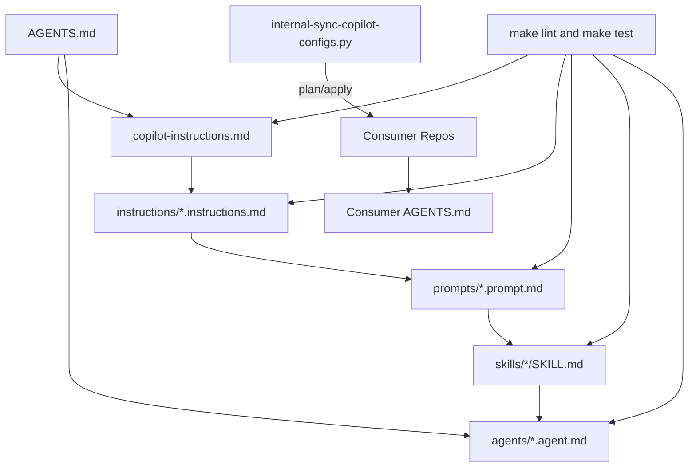

# Copilot Configuration Review — cloud-strategy.github

> **Status**: Historical audit record. Some findings below refer to removed validators, removed sync scripts, removed tests, or earlier bridge architecture states. Use `AGENTS.md`, `.github/copilot-instructions.md`, and `INTERNAL_CONTRACT.md` as the current contract.
> **Generated**: 2026-03-09
> **Scope**: Full audit of GitHub Copilot customization assets in `cloud-strategy.github` (global standards repository)
> **Purpose**: Actionable findings for Codex to fix. Each item includes the exact file, the problem, and the concrete fix required.
> **Note**: This review supersedes findings in `ANALYSIS_REPORT.md` (dated 2025-07-17). Items already resolved since that report are not repeated here.

---

## Table of Contents

- [Executive Summary](#executive-summary)
- [Critical Findings](#critical-findings)
- [Major Findings](#major-findings)
- [Minor Findings](#minor-findings)
- [Nit Findings](#nit-findings)
- [Architecture & Token Optimization](#architecture--token-optimization)
- [Missing Assets & Gaps](#missing-assets--gaps)
- [Action Checklist](#action-checklist)

---

## Executive Summary

The `cloud-strategy.github` repository is an impressive and well-thought-out framework for managing GitHub Copilot customization at scale. Since the original ANALYSIS_REPORT (July 2025), significant improvements have been made: prompt duplication has been consolidated to canonical origin-prefixed names, the sync script has grown to 2300+ lines with 20 tests, repo-only agents have been properly isolated, and the validator is robust at ~1200 lines. The framework is clearly production-grade.

However, this review identifies areas where Codex effectiveness can be further improved: **token budget waste from redundant content**, **missing infrastructure for key consumer stacks**, **test coverage gaps for the validator bash script**, and **governance enforcement blind spots** that reduce the framework's reliability at scale.

| Severity | Count |
|----------|-------|
| Critical | 1 |
| Major | 9 |
| Minor | 10 |
| Nit | 7 |

---

## Critical Findings

### C-01: `bootstrap-copilot-config.sh` is still active without deprecation — overlaps with sync script

**File**: `.github/scripts/bootstrap-copilot-config.sh`

The rsync-based bootstrap script and the manifest-based sync script (`internal-sync-copilot-configs.py`) serve overlapping purposes. The sync script is far superior (SHA tracking, conflict detection, profile-aware selection, JSON reports, conservative merge). The bootstrap script does destructive `--clean` syncs with no manifest tracking, no conflict detection, and no reporting. This creates confusion for Codex about which tool to use and risks destructive operations on consumer repos.

The ANALYSIS_REPORT (item 2.4) flagged this in July 2025 but it remains unresolved.

**Fix**:
1. Add a deprecation notice to the header of `bootstrap-copilot-config.sh`:
```bash
# ⚠️ DEPRECATED: Prefer internal-sync-copilot-configs.py for all consumer alignment.
# This script is maintained for backward compatibility only.
# See .github/DEPRECATION.md for lifecycle policy.
```
2. Record the deprecation in `.github/CHANGELOG.md`.
3. Update `copilot-quickstart.md` to recommend the sync script as the primary tool and the bootstrap script only as a legacy fallback.
4. Add the deprecation to `DEPRECATION.md` under "Current deprecations":
```markdown
## Current deprecations
- `scripts/bootstrap-copilot-config.sh`: Deprecated in favor of `scripts/internal-sync-copilot-configs.py`. Removal planned after all consumers migrate to sync-based alignment.
```

---

## Major Findings

### M-01: No versioning or release strategy — consumers cannot pin to a known-good state

**Files**: Repository root (missing `VERSION` file), `.github/CHANGELOG.md` (dates but no tags)

The ANALYSIS_REPORT (item 2.1) flagged this as Major. It is still unresolved. Consumer repos have no way to pin to a specific standards version. If a breaking change is pushed to `main`, all consumers are immediately affected.

**Fix**:
1. Create a `VERSION` file at the root with initial content: `1.0.0`
2. Add git tags at meaningful milestones (e.g., `v1.0.0` for the current stable state).
3. Update `internal-sync-copilot-configs.py` to include the source version in the manifest JSON.
4. Document the release process in a new `RELEASING.md` or in `CONTRIBUTING.md`.

---

### M-02: No `CONTRIBUTING.md` — contributors have no documented process

**File**: Missing — `CONTRIBUTING.md`

This is a standards repository that other teams consume. Without contribution guidelines, team members (and Codex) have no reference for how to add new instructions, prompts, skills, or agents correctly.

**Fix**: Create `CONTRIBUTING.md` with sections covering:
- How to add a new instruction file (naming, frontmatter, `applyTo`)
- How to add a new prompt (naming, frontmatter keys, skill reference)
- How to add a new skill (directory structure, SKILL.md template)
- How to add a new agent (naming, tools, restrictions)
- Naming conventions (origin-prefixed canonical names, `local-*` for consumer-local, `internal-*` for repo-owned assets)
- Required validation before PR (`make lint`, `make test`, and stack-specific checks)
- Required validation before PR (`make lint`, `make test`, and stack-specific checks)

---

### M-03: No `Makefile` for developer workflow

**File**: Missing — `Makefile`

The ANALYSIS_REPORT (item 2.6) flagged this. It remains unresolved. Without a Makefile, developers and Codex must remember individual commands for linting, testing, and validation.

**Fix**: Create `Makefile`:
```make
.PHONY: help lint validate test fmt all

help: ## Show available targets
	@grep -E '^[a-zA-Z_-]+:.*##' $(MAKEFILE_LIST) | sort | awk 'BEGIN {FS = ":.*##"}; {printf "  %-20s %s\n", $$1, $$2}'

lint: ## Run shellcheck and bash syntax checks
	bash -n .github/scripts/*.sh
	shellcheck -s bash .github/scripts/*.sh
	python3 -m compileall .github/scripts tests

validate: ## Show repository validation guidance
	@printf '%s\n' 'No repository-wide Copilot customization validator is configured.'

test: ## Run Python test suite
	pytest -q

fmt: ## Format Terraform files
	terraform fmt -recursive

all: lint validate test ## Run all checks
```

---

### M-04: Repository validation guidance should stay aligned with the actual toolchain

**Files**: `Makefile`, `CONTRIBUTING.md`, `AGENTS.md`

The repository should document only the validation steps that actually exist. Stale references to removed validators create false expectations for contributors and automation.

**Fix**:
1. Keep `make lint` and `make test` current with the real local checks.
2. Update repository documentation whenever validation steps are added or removed.
3. Avoid documenting repository-wide validators that no longer exist.

---

### M-05: `dependabot.yml` still contains unused package ecosystems

**File**: `.github/dependabot.yml`

The ANALYSIS_REPORT (item 2.3) flagged this. Check if `npm`, `maven`, `gradle` ecosystems are still present. This repository only contains Bash, Python, and pre-commit hooks. Unused ecosystems waste CI minutes.

**Fix**: Keep only the ecosystems relevant to this repo: `pip` (for pytest), `github-actions`, and optionally `terraform` (for pre-commit pin). Remove `npm`, `maven`, `gradle` if still present. If these ecosystems are intentionally kept as a template reference, move them to `templates/dependabot.template.yml` and document the intent.

---

### M-06: No `docker.instructions.md` despite many consumer repos using Docker

**File**: Missing — `.github/instructions/docker.instructions.md`

The `AGENTS.md` has a backlog trigger: "Add `instructions/docker.instructions.md` when the first Dockerfile is introduced in this repository." But consumer repos likely already use Docker, and this standards repo should proactively provide Docker guidance regardless of whether *this* repo has Dockerfiles.

**Fix**: Create `.github/instructions/docker.instructions.md`:
```instructions
---
description: Docker and container build standards for secure, efficient, and reproducible images.
applyTo: "**/Dockerfile,**/Dockerfile.*,**/.dockerignore,**/docker-compose*.yml"
---

# Docker Instructions

## Image build standards
- Use multi-stage builds to minimize image size.
- Run as non-root user.
- Use explicit base image tags with digests when possible.
- Keep `.dockerignore` up to date.
- Order layers for optimal cache usage (dependencies before source).

## Security
- No secrets in build args, ENV, or COPY.
- Scan images for vulnerabilities in CI.
- Minimize installed packages.

## Validation
- Build and test locally before pushing.
- Use health checks in orchestrated environments.
```

Also create a corresponding `prompts/internal-docker.prompt.md` and `skills/internal-docker/SKILL.md`.

---

### M-07: `copilot-quickstart.md` still references bootstrap script as primary tool

**File**: `.github/templates/copilot-quickstart.md`

The quickstart guide's "Alignment strategy" section recommends `bootstrap-copilot-config.sh` first and `internal-sync-copilot-configs.py` second. Given C-01 (bootstrap deprecation), the order should be reversed and the bootstrap should be mentioned only as a legacy option.

**Fix**: In the "Alignment strategy" section, change:
```markdown
## Alignment strategy
- Use `./.github/scripts/internal-sync-copilot-configs.sh --target <repo-path> --mode plan` for conservative alignment and minimum-asset selection (recommended).
- Use `.github/scripts/bootstrap-copilot-config.sh --target <repo-path>` only as a legacy quick-copy fallback.
- Prefer canonical origin-prefixed script prompts in consumer repositories.
```

---

### M-08: `ANALYSIS_REPORT.md` is stale and some findings are already resolved

**File**: `ANALYSIS_REPORT.md`

The report is dated 2025-07-17 and references issues that have been fixed (e.g., prompt duplication consolidated, code-review instructions refactored, tests expanded from 5 to 27). Keeping the stale report creates confusion for Codex, which may attempt to fix already-resolved issues.

**Fix**: Either:
1. Delete `ANALYSIS_REPORT.md` and replace with this `COPILOT_REVIEW.md` as the current audit.
2. Or add a clear header to `ANALYSIS_REPORT.md`:
```markdown
> **STATUS**: SUPERSEDED by `COPILOT_REVIEW.md` (2026-03-09). Many findings below have been resolved.
```

---

### M-09: Prompt `${input:...}` variable names are not standardized

**Files**: All prompt files under `.github/prompts/`

The ANALYSIS_REPORT (item 4.4) flagged inconsistent input variable naming. Prompts use various names for similar concepts: `target_file` vs `file_path` vs `target_path`, `description` vs `purpose` vs `feature_description`.

**Fix**:
1. Define a canonical variable name catalog (add to `copilot-instructions.md` or a new `prompts/README.md`):
   - `target_path`: the file or directory being acted upon
   - `purpose`: what the deliverable should accomplish
   - `language`: target programming language
   - `test_framework`: testing framework to use
   - `target_repo`: repository path for cross-repo operations
2. Audit all prompts and normalize variable names.
3. Add a validator check for canonical variable names.

---

## Minor Findings

### m-01: `agents/README.md` should reference repo-only agent exclusion

**File**: `.github/agents/README.md`

The agents README lists routing for all agents including repo-only ones (`internal-sync-global-copilot-configs-into-repo`), but does not explicitly mark them as non-syncable. This information is in `AGENTS.md` but should also be in the agents README for clarity.

**Fix**: Add a note to the README:
```markdown
## Repo-only agents (not synced to consumers)
- `internal-sync-global-copilot-configs-into-repo`
- `internal-agent-sync`
```

---

### m-02: Pre-commit config missing `shellcheck` hook

**File**: `.pre-commit-config.yaml`

The ANALYSIS_REPORT (item 5.2) flagged this. The CI installs shellcheck but developers don't get local feedback.

**Fix**: Add to `.pre-commit-config.yaml`:
```yaml
- repo: https://github.com/shellcheck-py/shellcheck-py
  rev: v0.10.0.1
  hooks:
    - id: shellcheck
      args: ["-s", "bash"]
```

---

### m-03: `requirements-dev.txt` pins only `pytest` — add type checking

**File**: `.github/requirements-dev.txt`

Currently only `pytest==8.3.3`. The 2300-line sync script and 1200-line validator would benefit from type-checking support.

**Fix**: Add `mypy` or at minimum `pyright`/`pylint` for static analysis:
```
pytest==8.3.3
mypy==1.14.1
```
Also consider adding `ruff` for linting Python scripts.

---

### m-04: No architecture diagram for the customization framework

**File**: Missing

The ANALYSIS_REPORT (item 7.2) recommended a Mermaid diagram. The framework's hierarchy (instructions → prompts → skills → agents) plus the sync/validate pipeline deserves visual documentation.

**Fix**: Add a Mermaid diagram to `.github/README.md`:
```markdown
## Architecture


```

---

### m-05: `security-baseline.md` controls lack enforcement coverage tracking

**File**: `.github/security-baseline.md`

The ANALYSIS_REPORT (item 5.1) flagged partial enforcement. The security baseline lists 11 controls but only ~4 are automated:

| Control | Automated? |
|---------|-----------|
| SHA pinning | Yes (validator) |
| Minimal permissions | No |
| OIDC over secrets | No |
| Branch protection | No |
| Validate `.github/**` in CI | Yes (workflow) |
| shellcheck on scripts | Yes (CI) |
| No embedded secrets in prompts | Partial (pre-commit) |
| Deterministic prompt output | No |
| Read-only agents default | No |
| Scoped write agents | No |
| Change governance via CHANGELOG | No |

**Fix**: Add an "Enforcement status" section to `security-baseline.md`:
```markdown
## Enforcement status
| Control | Status | Tool |
|---------|--------|------|
| SHA pinning | Manual review | — |
| Minimal permissions | Manual review | — |
| OIDC over secrets | Manual review | — |
| ...
```

---

### m-06: `AGENTS.md` "Preferred prompts" and "Preferred skills" have token-wasteful descriptions

**File**: `AGENTS.md`, "Repository Defaults" section

Each preferred prompt/skill includes a one-line description. These descriptions are already available in each prompt/skill's frontmatter `description:` field. Loading them here wastes tokens.

**Fix**: Reduce to just the name, and let Codex resolve the description from the frontmatter:
```markdown
### Preferred prompts
- `internal-code-review`
- `internal-github-action`
- `internal-sync-global-copilot-configs-into-repo`
- `internal-pr-editor`
- `internal-add-unit-tests`
- `internal-terraform`
```

Or keep descriptions only for prompts where the name is ambiguous.

---

### m-07: `CODEOWNERS` scope is narrow — bus factor of 2

**File**: `CODEOWNERS`

Only `@pagopa/engineering-cloud @GNuccio96` own all files. For a repository that impacts all consumer repos, this is a single-point-of-failure risk.

**Fix**: Consider adding a dedicated team like `@pagopa/copilot-standards` with at least 3-4 members. At minimum, add a backup reviewer.

---

### m-08: No secret scanning tool in CI

**File**: `.github/workflows/github-validate-copilot-customizations.yml`

Pre-commit has `detect-private-key` but there's no CI-level secret scanning (e.g., `gitleaks`, `trufflehog`).

**Fix**: Add a gitleaks step to the CI workflow:
```yaml
- name: Run gitleaks
  uses: gitleaks/gitleaks-action@<SHA> # <version>
  env:
    GITHUB_TOKEN: ${{ secrets.GITHUB_TOKEN }}
```

---

### m-09: `internal-sync-copilot-configs.py` — `PROMPT_NAME_OVERRIDES` is a maintenance burden

**File**: `.github/scripts/internal-sync-copilot-configs.py`, `PROMPT_NAME_OVERRIDES` dict

This dict maps prompt filenames to legacy canonical name values. Every new prompt with a non-obvious name mapping needs a manual entry. This is fragile.

**Fix**: Consider deriving the canonical name from the filename automatically using a naming convention function, and only using overrides for genuinely irregular cases. Or add a comment explaining the naming derivation rule and when an override is needed.

---

### m-10: `.bootstrap-ignore` is empty

**Files**: `.github/.bootstrap-ignore` (both repos)

The file exists but contains only comments. It is never effectively used.

**Fix**: Either populate with sensible defaults:
```
# Exclude source-only assets from bootstrap copies
templates/
tests/
ANALYSIS_REPORT.md
COPILOT_REVIEW.md
requirements-dev.txt
__pycache__/
.pytest_cache/
```
Or remove the file if the bootstrap script is deprecated (per C-01).

---

## Nit Findings

### N-01: `copilot-instructions.md` repeated "(or `.github/...` in `.github` layout)" parentheticals

**File**: `.github/copilot-instructions.md`

The file has 7 instances of the parenthetical `(or .github/... in .github layout)`. While this supports portability, it creates token overhead for every Codex session. Since both this repo and all known consumers use the `.github` layout, consider removing the parentheticals.

**Fix**: Remove the parenthetical layout references from `copilot-instructions.md` and instead add a single "Layout note" section at the top:
```markdown
## Layout
This repository uses `.github/` layout. All paths below are relative to `.github/` unless otherwise noted.
```

---

### N-02: `AGENTS.md` "Anti-patterns" section — good content but verbose

**File**: `AGENTS.md`, "Anti-patterns" section

Seven "Do not use X when..." bullets are excellent guidance but could be more token-efficient using a table format.

**Fix**: Convert to table:
```markdown
### Anti-patterns
| Don't | Instead |
|-------|---------|
| Planning capability for trivial single-file changes | Implementation capability directly |
| Implementation capability for ambiguous scope | Planning capability first |
| Generic review capability for domain-specific changes | Use matching specialist |
| ...
```

---

### N-03: Sync script `SOURCE_ONLY_AGENT_PATHS` should include the deprecated customization-auditor alias

**File**: `.github/scripts/internal-sync-copilot-configs.py`

The deprecated customization-auditor alias is in `SOURCE_ONLY_AGENT_PATHS`. Good. But verify the deprecated alias is also in the `AGENTS.md` inventory with a deprecation note. The current inventory lists it without a deprecation marker.

**Fix**: Deprecated aliases for removed agents should also be cleaned up from inventory.

---

### N-04: `CHANGELOG.md` entry dates — verify accuracy

**File**: `.github/CHANGELOG.md`

Entries are dated 2026-02-07 through 2026-03-08. Current date is 2026-03-09. The dates appear correct but double-check no entries have future dates or wrong ordering.

**Fix**: No action needed if dates are accurate.

---

### N-05: Skill files lack `dependencies:` frontmatter

**File**: All `skills/*/SKILL.md` files

The ANALYSIS_REPORT (item 4.1) recommended a `dependencies:` frontmatter field for machine-readable references. Skills reference instructions and other skills only in prose.

**Fix**: Long-term improvement. Add `dependencies:` to skill frontmatter:
```yaml
---
name: internal-terraform
description: ...
dependencies:
  - instructions/terraform.instructions.md
---
```
This enables automated dependency validation.

---

### N-06: `github-actions.instructions.md` checkout SHA example is outdated

**File**: `.github/instructions/github-actions.instructions.md`

The minimal example shows:
```yaml
uses: actions/checkout@8ade135a41bc03ea155e62e844d188df1ea18608 # v4.1.7
```

But the CI workflow itself uses `v6.0.2`. The example should match the current recommended version.

**Fix**: Update the example SHA and version to match the latest pinned version used in CI workflows.

---

### N-07: `copilot-quickstart.md` suggested starter sets use instruction-only references

**File**: `.github/templates/copilot-quickstart.md`

The "Suggested starter sets" section recommends instructions + prompts + skills but doesn't mention agents. Consumer repos also need agent files for effective Copilot usage.

**Fix**: Add agent recommendations to each starter set:
```markdown
- Java repositories: `java.instructions.md`, `internal-java.prompt.md`, `internal-project-java/SKILL.md`, plus planning, implementation, and review capabilities
```

---

## Architecture & Token Optimization

These are strategic recommendations to maximize Codex's context window efficiency:

### T-01: Flatten redundant content across `copilot-instructions.md` ↔ `AGENTS.md`

**Current state**: Both files repeat prohibitions, validation baseline, and portability notes.
**Recommendation**: `AGENTS.md` should be the single source for repo-specific routing and inventory. `copilot-instructions.md` should contain only cross-cutting behavioral rules. Remove all duplicated content from `AGENTS.md` that's already in `copilot-instructions.md`.

### T-02: Consider a slim `AGENTS.md` template for consumer repos

**Current state**: The generated `AGENTS.md` for consumers is ~160 lines with full routing, prohibitions, and inventory.
**Recommendation**: The `AGENTS.template.md` is already slim. Ensure the sync script generates AGENTS.md content closer to the template length (~50-60 lines) rather than the current ~160 lines. Every line costs Codex tokens on every session.

### T-03: Skill `SKILL.md` files should have a standardized "When to use" frontmatter field

**Current state**: Skills explain when to use them in prose body, wasting tokens for discovery.
**Recommendation**: Add `when:` frontmatter for quick matching:
```yaml
---
name: internal-terraform
description: Add or modify Terraform resources
when: Creating or modifying .tf files with resource, variable, output, or data blocks
---
```

---

## Missing Assets & Gaps

| Asset | Reason | Priority |
|-------|--------|----------|
| `CONTRIBUTING.md` | No contribution process documented | High |
| `Makefile` | No standardized developer commands | High |
| `VERSION` file | No versioning for consumer pinning | High |
| `instructions/docker.instructions.md` | Consumer repos use Docker | Medium |
| `prompts/internal-docker.prompt.md` | Pair with Docker instructions | Medium |
| `skills/internal-docker/SKILL.md` | Docker skill reference | Medium |
| Architecture Mermaid diagram | Visual aid for framework understanding | Medium |
| `instructions/sql.instructions.md` | DB migration safety | Low |
| `instructions/observability.instructions.md` | Cross-cutting logging standards | Low |

---

## Action Checklist

Ordered by impact on Codex effectiveness across all consumer repos:

### Phase 1 — Immediate (highest Codex impact)
- [ ] **C-01**: Deprecate `bootstrap-copilot-config.sh` and update `DEPRECATION.md`
- [ ] **M-01**: Implement versioning strategy (`VERSION` file + git tags)
- [ ] **M-02**: Create `CONTRIBUTING.md`
- [ ] **M-03**: Create `Makefile`
- [ ] **M-08**: Archive or supersede stale `ANALYSIS_REPORT.md`
- [ ] **N-01**: Remove repeated layout parentheticals from `copilot-instructions.md`

### Phase 2 — Short term (quality & safety)
- [ ] **M-04**: Expand validator test coverage to 15+ tests
- [ ] **M-05**: Clean up `dependabot.yml` unused ecosystems
- [ ] **M-06**: Create `docker.instructions.md` + prompt + skill
- [ ] **M-07**: Fix `copilot-quickstart.md` tool recommendations
- [ ] **m-02**: Add shellcheck to pre-commit
- [ ] **m-05**: Add enforcement status to `security-baseline.md`
- [ ] **m-08**: Add gitleaks to CI

### Phase 3 — Medium term (polish & optimization)
- [ ] **M-09**: Standardize prompt `${input:...}` variable names
- [ ] **m-01**: Add repo-only agent exclusion note to agents README
- [ ] **m-03**: Add mypy/ruff to dev requirements
- [ ] **m-04**: Create architecture Mermaid diagram
- [ ] **m-06**: Reduce AGENTS.md preferred prompts/skills verbosity
- [ ] **m-07**: Expand CODEOWNERS team
- [ ] **m-09**: Simplify PROMPT_NAME_OVERRIDES
- [ ] **m-10**: Populate or remove `.bootstrap-ignore`

### Phase 4 — Long term (strategic)
- [ ] **N-02**: Convert AGENTS.md anti-patterns to table
- [ ] **N-03**: Annotate deprecated agents in inventory
- [ ] **N-05**: Add `dependencies:` frontmatter to skills
- [ ] **N-06**: Update github-actions instruction example SHA
- [ ] **N-07**: Add agent recommendations to quickstart starter sets
- [ ] **T-01**: Flatten redundant content between copilot-instructions.md and AGENTS.md
- [ ] **T-02**: Optimize generated AGENTS.md length for consumers
- [ ] **T-03**: Add `when:` frontmatter to skills
