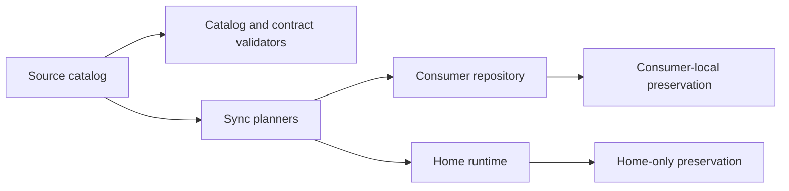

# Architecture

## 1. Purpose

This document describes the current architecture of the `cloud-strategy.github` standards repository. It records evidence-backed boundaries, components, interfaces, flows, and validation paths without replacing canonical policy or operational contracts.

## 2. System overview

The repository is a standards and source-management system for reusable GitHub Copilot customization assets. Source assets live mainly under `.github/`; descriptive knowledge lives under `docs/`; contract tests and validators check the source-side system. Synchronization projects those assets into consumer repositories and supported home runtimes while preserving target-owned files.

The diagram shows the current direction: validators and planners read source-owned declarations independently, while each synchronization boundary preserves its own target-owned resources.

## 3. Current vs intended architecture

| Area | Current architecture | Intended architecture | Status | Evidence |
| --- | --- | --- | --- | --- |
| Policy and projections | `AGENTS.md` is the portable policy entrypoint; `.github/copilot-instructions.md` is review-only. | Keep policy compact and surface-specific. | Documented | `AGENTS.md`, `.github/copilot-instructions.md`, `INTERNAL_CONTRACT.md` |
| Catalog governance | `.github/` contains source-managed skills, agents, instructions, inventory, tools, and templates. | Keep the inventory generated and source ownership explicit. | Documented | `.github/INVENTORY.md`, `.github/tools/inventory/inventory.py`, `docs/structure.md` |
| Synchronization | Local sync skills plan and apply source-to-consumer or source-to-home operations. | Preserve target-local assets and block ambiguous ownership. | Documented | `.github/skills/local-sync-repos/`, `.github/skills/local-agent-sync-install-ai-resources/` |
| Validation | Make targets, `.github/tools/run.sh`, and contract tests check source-side behavior. | Keep checks close to the contract owner. | Documented | `Makefile`, `.github/tools/`, `tests/`, `docs/tech.md` |

## 4. Technology stack

| Area | Technology | Status | Evidence |
| --- | --- | --- | --- |
| Automation and tests | Python 3.x | Evidenced | `pyproject.toml`, `Makefile`, `tests/` |
| Build and task entrypoints | Make and Bash scripts | Evidenced | `Makefile`, `.github/tools/run.sh`, `.github/scripts/` |
| Governance assets | Markdown, YAML, and JSON | Evidenced | `.github/`, `docs/`, `pyproject.toml` |
| CI and contract enforcement | GitHub Actions workflows plus local validators | Evidenced | `.github/workflows/`, `.github/tools/`, `Makefile` |
| Optional graph navigation | Graphify-generated repository outputs | Evidenced | `graphify-out/`, `.github/scripts/graphify-file-change-hook.sh` |

## 5. Repository map

| Path | Responsibility | Notes |
| --- | --- | --- |
| `AGENTS.md` | Portable precedence and operating baseline | Canonical always-on repository entrypoint. |
| `AGENTS.local.md` | Standards-repository-only routing and policy | Not a consumer-runtime default. |
| `.github/skills/` | Reusable guidance and synchronization engines | Bundles are self-contained; each owns its references and tests. |
| `.github/agents/` | Repository-owned route wrappers and command centers | Agent entrypoints are cataloged in `.github/INVENTORY.md`. |
| `.github/instructions/` | Review-scoped Copilot projections | Source-managed instructions use explicit frontmatter contracts. |
| `.github/tools/` | Inventory, catalog, skill, token, and shared validation tooling | `run.sh` is the command dispatcher. |
| `.github/templates/` | Source-side scaffold material | Not a runtime catalog family. |
| `docs/` | Descriptive repository knowledge | Includes domain docs, ADRs, guides, architecture, technology, and structure. |
| `tests/` | Root and cross-boundary contract tests | Skill-owned tests remain under their bundles. |
| `Makefile` | Maintainer validation entrypoints | Delegates to repository-owned runners. |
| `tmp/` | Retained plans and temporary analysis | Disposable support, not canonical knowledge. |

## 6. Architectural boundaries

| Boundary | Status | Evidence |
| --- | --- | --- |
| Binding policy versus descriptive docs | Documented | `AGENTS.md`, `docs/README.md`, `docs/structure.md` |
| Source catalog versus runtime projections | Documented | `INTERNAL_CONTRACT.md`, `.github/INVENTORY.md`, `.github/skills/local-agent-sync-install-ai-resources/references/sync-contract.md` |
| Source-managed versus consumer-local assets | Documented | `INTERNAL_CONTRACT.md`, `.github/skills/local-sync-repos/references/sync-contract.md` |
| Skill-owned tests versus root cross-boundary tests | Enforced | `tests/test_repository_test_layout_contract.py`, `pytest.ini` |
| Repository source versus external imported content | Documented | `AGENTS.md`, `AGENTS.local.md`, `.github/INVENTORY.md` |
| Product runtime hosting | Out of scope | `docs/repository-context.md`, `docs/structure.md` |

## 7. Dependency rules

### Allowed direction

- Source-managed assets may be consumed independently by catalog validators and synchronization planners. Evidence: `.github/tools/catalog/rules.py`, `.github/skills/local-sync-repos/SKILL.md`, `.github/skills/local-agent-sync-install-ai-resources/SKILL.md`.
- Synchronization planners may produce consumer-repository or home-runtime projections through their explicit contracts. Evidence: `.github/skills/local-sync-repos/references/sync-contract.md`, `.github/skills/local-agent-sync-install-ai-resources/references/sync-contract.md`.
- Contract tests may inspect source files, validators, and sync behavior; skill-owned tests remain with their owning bundle. Evidence: `AGENTS.md`, `pytest.ini`, `tests/test_repository_test_layout_contract.py`.
- Descriptive docs may link to policy, catalog, and implementation owners without becoming those owners. Evidence: `docs/README.md`, `docs/structure.md`.

### Avoid / forbidden

- Do not treat `.github/INVENTORY.md` as a policy owner or manually duplicate its volatile catalog. Evidence: `AGENTS.local.md`, `INTERNAL_CONTRACT.md`.
- Do not synchronize `AGENTS.local.md` or consumer-local knowledge as source-managed policy. Evidence: `.github/skills/local-sync-repos/SKILL.md`, `INTERNAL_CONTRACT.md`.
- Do not infer ownership, trust, or runtime support from a directory name alone. Evidence: `AGENTS.md`, `.github/skills/local-agent-sync-install-ai-resources/references/runtime-support-matrix.yaml`.
- Do not restore retired automation or paths as active contracts. Evidence: `INTERNAL_CONTRACT.md`.

## 8. Key flows

### Runtime flow

#### Consumer repository synchronization

1. The repository sync contract defines exact managed copy paths, discovered source instructions, and preserved target-local paths.
2. `plan` compares source and target, reports create, update, delete, and preserve operations, and writes only its retained plan under the target `tmp/` directory.
3. `apply` requires the matching plan fingerprint and blocks dirty managed overlap, stale plans, and invalid source contracts.
4. A fresh plan proves convergence when it reports no managed mutations.

Evidence: `.github/skills/local-sync-repos/references/sync-contract.md`, `.github/skills/local-sync-repos/scripts/sync_contract.py`, `.github/skills/local-sync-repos/scripts/sync_repos.py`.

#### Home-runtime synchronization

1. The home sync catalog and runtime support matrix select eligible resources and materialization modes.
2. `plan` reports links, copied projections, skips, unlinks, and blockers without applying them.
3. `apply` enforces path safety, verifies link identity or expected content hashes, and writes manifest state only after successful verification.
4. Home-only and catalog-excluded resources remain unmanaged and preserved.

Evidence: `.github/skills/local-agent-sync-install-ai-resources/references/home-sync-catalog.yaml`, `.github/skills/local-agent-sync-install-ai-resources/references/runtime-support-matrix.yaml`, `.github/skills/local-agent-sync-install-ai-resources/references/sync-contract.md`.

### Build/test flow

1. Maintainers use Make targets or `.github/tools/run.sh` as the standard entrypoints. Evidence: `Makefile`, `.github/tools/run.sh`.
2. Python contract tests run from `tests/` and skill-owned bundle test roots. Evidence: `pytest.ini`, `tests/test_repository_test_layout_contract.py`.
3. Catalog, skill, Markdown, shell, and token-risk checks run through separate targets. Evidence: `Makefile`.

## 9. Configuration and environment

| Configuration | Role | Evidence |
| --- | --- | --- |
| `.python-version` | Selects the repository Python major/minor validation target. | `Makefile` |
| `pyproject.toml` | Defines Ruff configuration and Python lint scope. | `pyproject.toml` |
| `pytest.ini` | Defines root and skill-owned test discovery. | `pytest.ini`, `tests/test_repository_test_layout_contract.py` |
| `.github/INVENTORY.md` | Records the generated live catalog paths. | `.github/tools/inventory/inventory.py` |
| Skill YAML references | Declare synchronization support and eligible resources. | `.github/skills/local-agent-sync-install-ai-resources/references/` |
| Runtime environment | May provide optional external tools such as `shellcheck`, `npx`, and Graphify. | `Makefile`, `.github/scripts/` |

## 10. Testing and validation

| Change type | Suggested validation | Evidence |
| --- | --- | --- |
| Markdown or knowledge docs | `make docs-lint`; inspect links and headings. | `Makefile`, `.github/skills/internal-markdown/` |
| Catalog or inventory | `make catalog-check`; `make catalog-lint`. | `Makefile`, `.github/tools/catalog/`, `.github/tools/inventory/` |
| Skill bundle | `make skill-lint`; bundle tests. | `Makefile`, `.github/tools/skills/`, `.github/skills/*/tests/` |
| Python validators or sync logic | Focused `pytest`, then `make lint` and `make test`. | `Makefile`, `pytest.ini`, `tests/` |
| Root policy or major AI assets | `make token-risks`. | `AGENTS.local.md`, `Makefile` |

## 11. Architectural decisions visible in the repo

| Decision | Status | Evidence | Trade-off | Related ADR |
| --- | --- | --- | --- | --- |
| Keep `internal-terraform` as the stable wrapper and route language-only HCL to `internal-tf`. | Documented | `docs/adr/0001-terraform-skill-routing-boundaries.md` | Preserves a stable entrypoint while keeping operational depth conditional. | [ADR 0001](adr/0001-terraform-skill-routing-boundaries.md) |
| Use separate catalog-governance and source-synchronization knowledge contexts. | Documented | [ADR 0002](adr/0002-knowledge-domain-layout.md), `CONTEXT-MAP.md` | Adds navigation and glossary boundaries while requiring cross-context links. | [ADR 0002](adr/0002-knowledge-domain-layout.md) |
| Keep the generated inventory separate from stable policy. | Documented | `INTERNAL_CONTRACT.md`, `.github/INVENTORY.md` | Adds a generated artifact to maintain, but reduces policy drift. | None |

## 12. AI-agent working rules

- Read this document, the relevant context glossary, and applicable ADRs before structural changes.
- Preserve existing patterns, ownership boundaries, and source-versus-target contracts.
- Keep changes scoped to the smallest valid owner and report conflicts before editing.
- Update this architecture document when an intentional architectural change alters a recorded boundary or flow.
- Prefer existing repository patterns over new abstractions.
- Do not introduce new frameworks or cross-cutting refactors without explicit approval.

## 13. Last verified

- Verification date: 2026-09-01.
- Agent or tool: GitHub Copilot using the repository-local `internal-knowledge` workflow, targeted source inspection, and repository validators.
- Files inspected: `AGENTS.md`, `AGENTS.local.md`, `README.md`, `.github/README.md`, `.github/INVENTORY.md`, `INTERNAL_CONTRACT.md`, `Makefile`, `pyproject.toml`, `pytest.ini`, descriptive docs, catalog and skill rules, synchronization contracts, synchronization implementations, and representative sync tests.
- Commands run: repository status and tracked-file inventory, targeted searches, Markdown diagnostics, link and anchor checks, `make docs-lint`, repository validation targets, and `git diff --check`.
- Confidence: High for source-side boundaries and current validation entrypoints; medium for external consumer adoption and optional runtime availability. The persisted Graphify corpus was present, but its query output was not available for claim verification in this run.

## 14. Unknown / To verify

- Which consumer repositories currently rely on retired knowledge paths or historical synchronization behavior.
- Whether every generated or synchronized artifact is covered by a current validator and inventory entry.
- The minimum Python patch version required across contributor environments.
- Availability and versions of optional external tools outside the repository runners.
- Consumer-side deployment or runtime topology after materialization; it is outside this repository's ownership boundary.
