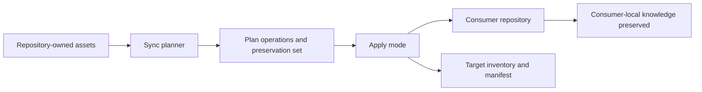

# Architecture

## Purpose

This document describes the current architecture of the standards repository.
It focuses on boundaries, components, interfaces, and flows that are supported
by repository evidence.

## Scope Boundary

In scope:

- Source agent-policy entrypoint and review-only Copilot configuration.
- Repository-owned skills, agents, prompts, and templates.
- Catalog build and consistency tooling.
- Sync planning and apply automation.
- Contract and regression tests.

Out of scope:

- Product runtime hosting.
- Consumer-specific operational ownership after sync materialization.
- Service-level deployment topology for external workloads.

## External Interfaces

- Git and filesystem state used by sync and validation scripts.
- Consumer repositories used as sync targets.
- Optional upstream imported assets tracked through local contracts.

## Logical Components

| Component | Path | Responsibility |
| --- | --- | --- |
| Agent policy entrypoint | `AGENTS.md` | Stable precedence, ownership, and tactical defaults. |
| Copilot review file | `.github/copilot-instructions.md` | Review-only behavior for GitHub.com Copilot code review. |
| Review assets | `.github/` review-scoped assets | Source-managed defect-first review behavior kept outside runtime agent policy. |
| Knowledge docs | `docs/` | Descriptive repository context, architecture, tech, and structure. |
| Skills and agents | `.github/skills/`, `.github/agents/` | Reusable guidance plus route wrappers and command centers. |
| Prompts and templates | `.github/prompts/`, `.github/templates/` | Targeted creators and consumer scaffold sources. |
| Sync engine | `.github/scripts/lib/syncing.py` | Plan/apply logic for source-managed alignment and safe preservation. |
| Validation layer | `tests/`, `Makefile`, `.github/scripts/` | Contract and regression checks for governance and sync behavior. |

## Key Flow

## Quality Attributes

- Safety: preserve target-authored local assets and block ambiguous migrations.
- Traceability: maintain explicit inventory and sync manifests.
- Determinism: use contract-driven templates and explicit validators.
- Maintainability: keep policy in canonical owners and docs descriptive.

## Risks And Open Questions

| Risk | Current evidence | Recommended handling |
| --- | --- | --- |
| Contract drift between policy and sync behavior | Multiple surfaces define adjacent behavior. | Update contract text, automation, and tests in the same change. |
| Overloaded always-on guidance | Bridge and projection must stay compact. | Keep procedural detail in skills and references. |
| Consumer-local overwrite risk | Sync applies mutations across mirrored families. | Keep preserve and manual-block logic explicit for local files. |

## Unknown / To Verify

- Any consumer repositories still relying on retired knowledge paths.
- Historical path variants not currently covered by sync tests.
